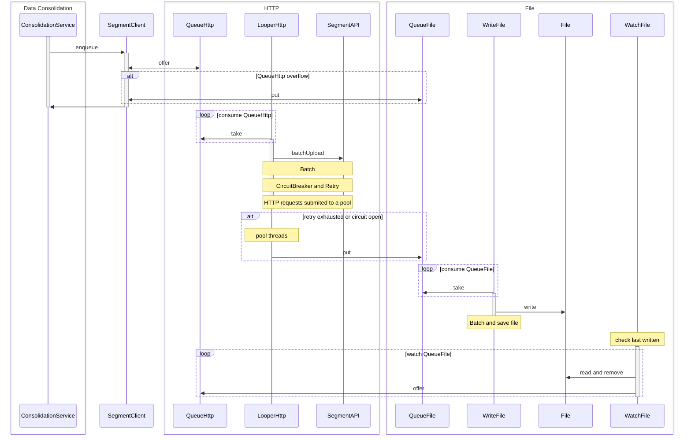

```mermaid

sequenceDiagram    
    box Data Consolidation
        participant ConsolidationService
    end
    
        participant SegmentClient
    box HTTP
        participant QueueHttp        
        participant LooperHttp        
        participant SegmentAPI
    end
    box File
        participant QueueFile
        participant WriteFile
        participant File
        participant WatchFile
    end
    
    activate ConsolidationService
    ConsolidationService->>+SegmentClient: enqueue    
    SegmentClient<<->>QueueHttp: offer 
    alt QueueHttp overflow
        SegmentClient<<->>QueueFile: put
    end
    SegmentClient->>-ConsolidationService: 
    deactivate ConsolidationService

    loop consume QueueHttp
        LooperHttp->>QueueHttp:take
        activate LooperHttp       
    end
    LooperHttp->>SegmentAPI: batchUpload
    note over LooperHttp,SegmentAPI: Batch
    note over LooperHttp,SegmentAPI: CircuitBreaker and Retry
    note over LooperHttp,SegmentAPI: HTTP requests submited to a pool
    deactivate LooperHttp

    alt retry exhausted or circuit open
        note over LooperHttp: pool threads
        LooperHttp->>QueueFile: put
    end

    loop consume QueueFile
        WriteFile->>QueueFile:take
        activate WriteFile       
    end
    WriteFile->>File: write
    note over WriteFile: Batch and save file
    deactivate WriteFile

    note over WatchFile: check last written 
    activate WatchFile
    loop watch QueueFile        
        WatchFile->>File: read and remove
        WatchFile->>QueueHttp: offer
    end
    deactivate WatchFile
```
