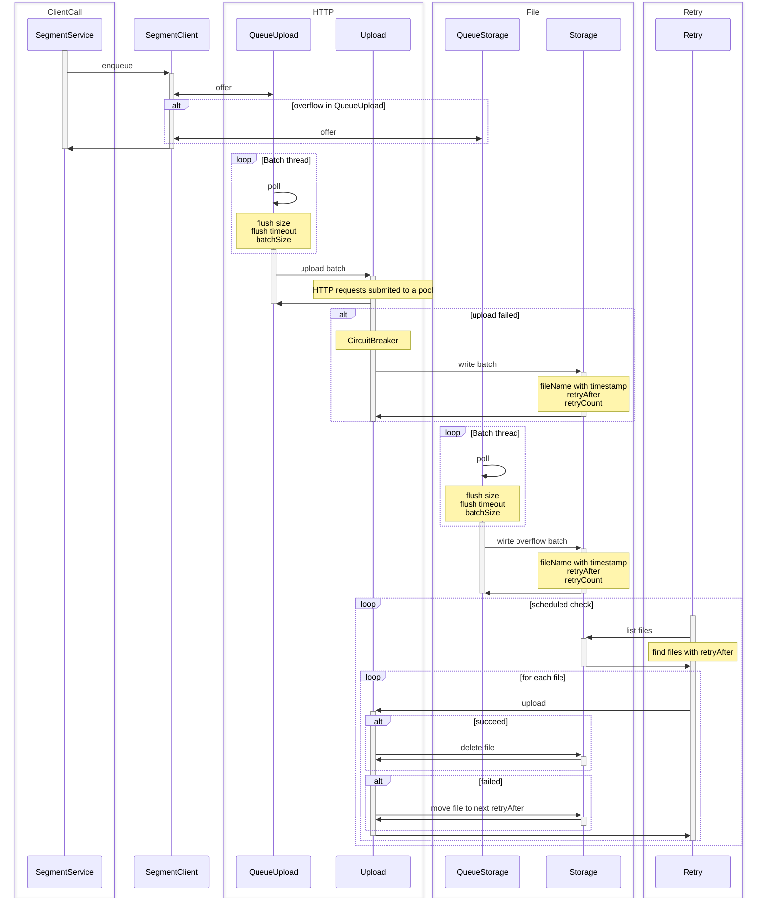

# Why This Client?

This Java Segment analytics client is designed for **server-side reliability, durability, and operational transparency**. It addresses the limitations of both `analytics-java` (which can lose events) and `analytics-kotlin` (which always writes to disk).

- **Durable by Default:**  
  Events are only written to disk if uploads fail or queues overflow, minimizing disk I/O under normal conditions. This ensures durability without unnecessary performance costs.

- **Robust Reliability:**  
  Features configurable retries, exponential backoff, and a circuit breaker to handle API outages. Failed uploads are stored on disk and retried at configurable intervals. Batches are deleted once all retries are exhausted, ensuring disk usage remains bounded.

- **Bounded Resource Usage:**  
  Strict backpressure and queue limits prevent unbounded memory or disk growth. If queues are full, events are dropped or the producer is briefly blocked, depending on configuration.

See [WHY.md](WHY.md) for a detailed comparison with other Segment clients and the design rationale.

---


### Back Pressure and `blockTimeout` Configuration

By default, all queues are **non-blocking** (`blockTimeout = 0`):

- If the upload queue is full, the event is immediately offered to the storage queue.
  > Increasing `blockTimeout` helps avoid disk usage under high load, at the cost of potentially blocking the producer briefly.
- If the storage queue is also full, the event is dropped and a log message is emitted.
  > Increasing `blockTimeout` can enforce that no messages are lost, at the cost of potentially blocking the producer.

See [Defaults.java](src/main/java/com/segment/analytics/config/Defaults.java) for all default values.

### Retry Policy

Failed uploads are stored on disk and retried according to the configured retry schedule (`segment.retry.at`).  
**Once the last retry delay is exhausted, the pending batch is deleted.**  
This ensures disk usage is bounded and prevents infinite retry loops.

---

## Minimal Usage

```java
import com.segment.analytics.Analytics;
import com.segment.analytics.config.StorageConfig;
import com.segment.analytics.dto.TrackMessage;

Analytics analytics = Analytics.builder("YOUR_WRITE_KEY")
    .storageConfig(StorageConfig.builder()
        .filePath("/tmp/segment-pending") 
        .build())
    .build();

// Enqueue a message
analytics.enqueue(new TrackMessage("userId", "event"));

// Shutdown the client gracefully
analytics.close();
```

---

## System Properties (Configuration Overrides)

System properties can be used to override default values for configuration options. Set these as JVM arguments (e.g., `-Dsegment.analytics.http.queue.size=1000`).  
**If a value is set via the builder, the system property is ignored.**

| System Property                                 | Description                                                        | Default Value                |
|-------------------------------------------------|--------------------------------------------------------------------|------------------------------|
| segment.queue.http.size                         | Size of the HTTP upload queue                                      | 1_000                        |
| segment.queue.http.flushSize                    | Max number of elements in an HTTP batch                            | 50                           |
| segment.queue.http.flushMs                      | Max milliseconds without an HTTP batch flush                       | 30_000                       |
| segment.queue.http.blockTimeout                 | Max milliseconds to wait to put an element in the HTTP queue       | 0                            |
| segment.http.circuitErrorsInAMinute             | Number of failures in 1 minute to open the HTTP circuit breaker    | 10                           |
| segment.http.circuitSecondsInOpen               | Seconds to wait in open state before half-open                     | 30                           |
| segment.http.circuitRequestsToClose             | Number of successes to close the HTTP circuit breaker              | 1                            |
| segment.http.executorSize                       | Max number of concurrent HTTP upload requests                      | 2                            |
| segment.http.executorQueueSize                  | Max number of HTTP upload requests waiting to be executed          | 0                            |
| segment.http.connectionTimeoutSeconds           | Max seconds to wait to establish an HTTP connection                | 15                           |
| segment.http.readTimeoutSeconds                 | Max seconds to wait for an HTTP reply                              | 20                           |
| segment.http.gzip                               | Use compression on the HTTP request (true/false)                   | true                         |
| segment.queue.storage.size                      | Size of the disk storage queue                                     | 1_000                        |
| segment.queue.storage.flushSize                 | Max number of elements in a disk batch                             | 50                           |
| segment.queue.storage.flushMs                   | Max milliseconds without a disk batch flush                        | 30_000                       |
| segment.queue.storage.blockTimeout              | Max milliseconds to wait to put an element in the disk queue       | 0                            |
| segment.storage.file                            | Path to save pending messages                                      | segment-pending-batches      |
| segment.retry.delaySeconds                      | Seconds to wait between retry executions                           | 60                           |
| segment.retry.initialDelaySeconds               | Seconds to wait before the first retry execution                   | 60                           |
| segment.retry.at                                | Sequence of retry delays (comma-separated, with units s/m/h/d)     | 1s,30s,1m,5m,15m,1h,12h,1d,4d,7d,30d,60d |

---

## Architecture Overview


